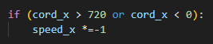
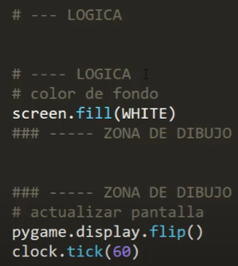

# Desarrollo de videojuegos en python con librería pygame.
Este cursito lo saque del siguiente link. https://www.youtube.com/playlist?list=PLuB3bC9rWQAu6cGeRo_I6QV8cz1_2V6uM

## Video 1
Basicamente se vió cual es la estructura que tiene un codigo.
Un juego no es mas que un bucle gigante que se repite una y otra vez. tengo que crear un bucle infinito digamos

* Estructura
```py
import pygame
pygame.init()

crear una ventana
size = (800,500) //tupla

screen = pygame.display.set_mode(size)

while True: 
    for event in pygame.event.get():
        if event.type == pygame.QUIT: #si el evento es del tipo QUIT
            sys.exit()                 #salir del sistema
```
## Video 2
En esta clase se aprendio a como dibujar formas geometricas. Se definio la zona de dibujado y se aprendio como poner colores. A su vez tambien como actualizar la pantalla.

* Figuras geometricas: Se definen colores en rgb de 8 bits.
```py
            R  G  B
BLACK  =  ( 0, 0, 0 )
WHITE  =  ( 255, 255, 255 )
GREEN  =  ( 0, 255, 0 )
RED    =  ( 255, 0, 0 )
BLUE   =  ( 0, 0, 255 )
``` 
```txt
screen.fill(WHITE) --> PINTAR LA PANTALLA DE BLANCO
-----------------------------------------------------
la zona que va debajo de pintar pantalla es nuestra zona de dibujo

-----------------------------------------------------
pygame.display.flip() --> actualizar pantalla
``` 

dibujar una linea:
                donde   color ubicacion(punto inicio, punto final) grosor
pygame.draw.line(screen,GREEN,[0,100],[100,100],5)

ejemplo linea en diagonal
pygame.draw.line(screen,GREEN,[0,100],[200,300],5)

todo lo que vos quieras dibujar esta aca: https://www.pygame.org/docs/ref/draw.html

ejemplo dibujar un cuadrado: 
pygame.draw.rect(screen,BLACK,(100,100,80,80))
(x,y,ancho,largo)

ejemplo dibujar un circulo: 
circle(surface,color,center,radius)
    pygame.draw.circle(screen,RED,(200,200),30)

```py
import pygame,sys
pygame.init()

BLACK  =  ( 0, 0, 0 )
WHITE  =  ( 255, 255, 255 )
GREEN  =  ( 0, 255, 0 )
RED    =  ( 255, 0, 0 )
BLUE   =  ( 0, 0, 255 )

size = (800,500)

screen = pygame.display.set_mode(size)

while True: 
    for event in pygame.event.get():
        if event.type == pygame.QUIT:
            sys.exit()

    screen.fill(WHITE)
    pygame.draw.line(screen,GREEN,[0,100],[200,300],5)
    pygame.draw.circle(screen,RED,(200,200),30)
    pygame.display.flip()
```
## Video 3
Basicamente vimos una forma sencilla de con los for poder dibujar las figuras y definirlas.

```py
for i in range(100,700,100): #el pone range(pixel donde va a iniciar, donde va a terminar, como va a ir avanzando de a cuantos pixeles.)
    pygame.draw.rect(screen, BLACK , (x,230,50,50))
```

## Video 4
vamos a animar un cuadrado. Vamos a jugar con los ejes x y

definio coordenadas y velocidades (fuera del while)

```py
cord_x = 400 #donde va a arrancar el cuadrado
cord_y = 200

speed_x = 3 #es una variable que me va a ayudar a aumentar o disminuir la velocidad.
speed_y = 3


while True: 
    for event in pygame.event.get():
        if event.type == pygame.QUIT:
            sys.exit()

    cord_x += speed_x
    
    screen.fill(WHITE)

    pygame.draw.rect(screen, BLACK , (cord_x,cord_y,80,80))

    pygame.display.flip()
```
con esta estructura ya tenes una animación, el tema es que va a las chapas. Tenemos que definir un reloj.

* definir un reloj: clock = pygame.time.Clock() 
* se define tambien el valor del reloj. se pone debajo del display flip --> clock.tick(60)

* vamos a hacer algo clave. Vamos a hacer que el cuadrado rebote. Es una pabada, hizo una simple comprobacion.


```py
import pygame,sys
pygame.init()

BLACK  =  ( 0, 0, 0 )
WHITE  =  ( 255, 255, 255 )
GREEN  =  ( 0, 255, 0 )
RED    =  ( 255, 0, 0 )
BLUE   =  ( 0, 0, 255 )

size = (800,500)

screen = pygame.display.set_mode(size)

clock = pygame.time.Clock()

cord_x = 400
cord_y = 200

speed_x = 3
speed_y = 3

while True: 
    for event in pygame.event.get():
        if event.type == pygame.QUIT:
            sys.exit()

    if (cord_x > 720 or cord_x < 0): 
        speed_x *=-1
    if (cord_y > 420 or cord_y < 0):
        speed_y *= -1

    cord_x += speed_x
    cord_y += speed_y
    screen.fill(WHITE)

    pygame.draw.rect(screen, BLACK , (cord_x,cord_y,80,80))

    pygame.display.flip()
    clock.tick(60)
```
Cual es el mejor orden para programar nuestro juego



## video 5
Enseña a hacer una animación en particular.

## video 6
vamos a aprender a usar el mouse para mover cosas.

mouse_pos = pygame.mouse.get_pos() -- > esto me devuelve tuplas con la direccion del mouse. EJ: (499,2)
acordate que para acceder a la tupla uso x ejemplo x = tupla[0] y = tupla[1]

otra cosa es que no se vea el mouse para eso uso
pygame.mouse.set_visible(0) --> si pongo cero no se ve si pongo uno si se ve.

```py
import pygame,sys
pygame.init()

BLACK  =  ( 0, 0, 0 )
WHITE  =  ( 255, 255, 255 )
RED    =  ( 255, 0, 0 )

size = (800,500)
screen = pygame.display.set_mode(size)
clock = pygame.time.Clock()

pygame.mouse.set_visible(0)

while True: 
    for event in pygame.event.get():
        if event.type == pygame.QUIT:
            sys.exit()

    mouse_pos = pygame.mouse.get_pos()
    x = mouse_pos[0]
    y = mouse_pos[1]
    screen.fill(WHITE)

    pygame.draw.rect(screen,RED,(x,y,100,100))
    
    pygame.display.flip()
    clock.tick(60)
```

