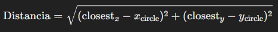

# cosas a tener en cuenta.

## circle_movement_with_player()
    Esta funcion requiere de cierta complejidad matematica. La desarrollo rapidamente.
* Necesitamos calcular los limites del cuadrado del jugador, esto es sencillo. Tenemos un ancho un largo y tenemos que las coordenadas (x,y). x es la esquina inferior izq y y es el centro de la coordenada vertical.
```py
# Calcular los bordes del rectángulo
    rect_left = x_player - width / 2
    rect_right = x_player + width / 2
    rect_top = y_player - length / 2
    rect_bottom = y_player + length / 2
```
* Necesitamos detectar la colision. La colision se verifica comparando la distancia entre el centro del circulo y el punto mas cercano del rectangulo con el radio del circulo. Esta distancia se calcula como: 

    
    La colision va a ocurrir cuando esta distancia sea menor o igual al radio del circulo (pelota). Para verificar esto utilizamos: 
    

